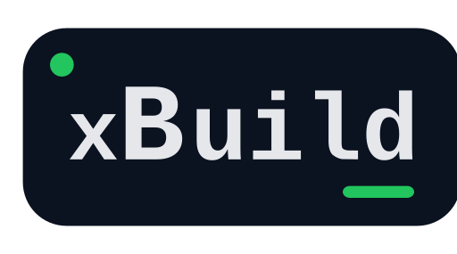

An extensibility-first, low ceremony, C# task-based build automation system. Originally inspired
by [NUKE Build](https://github.com/nuke-build/nuke).

> ***jig** (tool): a type of custom made tool used to control the location and motion of other parts or tools*

## Getting Started

Ensure your project is within a git repository:

```shell
git init
```

Create a new console application:

```shell
dotnet new console -n build
```

Add the package:

```shell
dotnet add package Jig
dotnet add package Jig.Shell
dotnet add package Jig.Serilog
```

```xml

<PackageReference Include="Jig" Version="X.Y.Z"/>
<PackageReference Include="Jig.Shell" Version="X.Y.Z"/>
<PackageReference Include="Jig.Serilog" Version="X.Y.Z"/>
```

Add Targets:

```csharp
using System.CommandLine;
using Jig.Targets;

namespace _build.Targets;

public class Targets : IBuildTargets 
{
    public const string SolutionPath = "Jig.sln";

    BuildOption<string> Verbosity { get; } = new("minimal", description: "Verbosity for dotnet tasks" );

    private ITarget Build => field ??= new Target(description: "Builds the solution")
        .Executes($"dotnet build {SolutionPath} --verbosity {Verbosity}");

    private ITarget Test => field ??= new Target(description: "Tests the solution")
        .After(() => Build)
        .Executes($"dotnet test {SolutionPath} --verbosity {Verbosity}");

    private ITarget MergeCheck => field ??= new Target(description: "Runs required merge checks")
        .DependsOn(Build, Test);
}
```

Program.cs:

```csharp
await new Build(workingDirectory: "src")
    .AddShell()
    .AddSerilog()
    .AddTargetsFromEntryAssembly()
    .ExecuteAsync(args);
```

Then run! No further setup required:

```shell
dotnet run --project build/build.csproj -- {args}
```

## Features Summary

1. Fluent, flexible and low ceremony target definition and execution engine
1. First class dependency injection support
1. Straightforward calling of CLI tools with `Shell` extension
1. Dry run capability
1. Fully inspectable target DAG, powered by [QuikGraph](https://github.com/KeRNeLith/QuikGraph)
1. Result passing between targets
1. High extensibility
1. Maintainable low footprint (< 3000 cloc)

## Core Concepts

Jig core contains the bare minimum code required to construct and execute a target graph. The core is
then extended to provide additional functionality.

### Build Construction

Jig builds are created through the `Build` class, which is a thin wrapper around a
`Microsoft.Extensions.DependencyInjection` DI container which is used for initialization of services
required by the build:

```csharp
await new Build(workingDirectory: "src")
    .AddShell() // Adds depdendencies required for shell execution 
    .AddSerilog() // Adds a serilog backed logging implemenation
    .AddTargetsFromEntryAssembly() // Add target classes implemented
    ... // Add other serivices and extensions
    .ExecuteAsync(args); // Run the build 
```

A single `ServiceProvider` is initialized and used during the build. A scope is created for each target when
executed.

### Build Initialization

When the build is executed, the following initialization actions are taken:

1. Environment variables are loaded from any .env file found in the directory path to the build executable
2. The process working directory is changed to the parent directory containing .git
3. An instance of `BuildOptions` implementing `IOptionProvider` is registered as a singleton. Build options specifies
   the following options which are supplied to the build execution:
    1. **Targets**: Targets to run
    2. **Exclude**: Targets to exclude
    3. **Skipped**: Targets to skip
    4. **BuildConcurrency**: The concurrency to use for target execution
4. An instance of `IBuildContext` is registered as a singleton, which holds information about the build, including the
   `TargetGraph`.

### Targets

Build targets are executable units of functionality that can be invoked, and can express dependencies and execution
ordering relative to each other. Targets are collected by the build from any service implementing `ITargetProvider` and
used to build a `TargetGraph` instance, which contain Directed Acyclic Graphs modeling the targets dependencies and
execution ordering. The build will check for cycles in execution ordering and throw if they exist. Targets are executed
in the order that they are invoked, and then according to the resulting graph topology.

**Excluded** targets are not included as options in the build when constructing the final build graph. As such their
relationships with other targets are also ignored.

**Skipped** targets are included in the build as normal if invoked, but their executions are not run.

If the **BuildConcurrency** is set to `Sequential`, targets are run one at a time. In the absence of
clear target ordering, order of execution is arbitrary. If it is `Parallel`, targets are run concurrently except when
there is an explicit execution order specified.

An example of the options available when declaring targets:

```csharp
// Target classes support dependency injection
public class MyTargets(IMySingleton singleton) : ITargetProvider
{
    // Targets are best specified as lazy loaded properties
    public ITarget One => field ??= new Target(description: "Some target")
        .Executes((IMyScoped scoped) => 
        {
            // This action will be run when the target is run, supports dependency injection
        });
    
    public ITarget Two => field ??= new Target(description: "Some other action")
        .DependsOn(() => One) // causes the specified target to be triggered by this target is, and run before
        .Executes(async () => 
        {
             // Executions can be asynchronous
        });
    
    public ITarget Three => field ??= new Target()
        .After(() => One) // ensures this target is run after the specified target
        .Before(() => Two) // ensures this target is run before the specified target 
        .Executes(async (IMyScoped scoped) => 
        {
             // Do something asynchronously
        });
        .Executes(() => 
        {
            // A target can have multiple executions that are always run consecutively
        });
    
    public ITarget Four => field ??= new Target()
        .DependentFor(() => Three) // this target is triggered by and run before the specified target
        .Executes(() => 
        {
            // Tasks can return data, which becomes available to subsequent target executions
            return new [] {"Task Result Data"};
        });
    
    public ITarget Five => field ??= new Target()
        .DependsOn(() => Four) 
        .ProceedAfterFailure() // The build should continue to run if this target fails
        .Executes((ITargetLogger logger, string[] results) => 
        {
            logger.LogInformationFormat(results.First());
            throw new Exception(); // Targets only fail if they throw an exception
        });
}
```

Target providers can be added to the build like so:

```csharp
await new Build(workingDirectory: "src")
    .AddTargets<MyTargets>()
    .ExecuteAsync(args); 
```

When target providers are registered, they can be resolved via dependency injection, and referred to by other
targets providers like so:

```csharp
public class OtherTargets(MyTargets targets) : ITargetProvider
{
    public ITarget Six => field ??= new Target()
        .DependsOn(() => targets.One);
}
```

### Options

Jig provides expanded support for custom CLI and Environment variable options using `System.CommandLine`.

`BuildOption` represents a variable that is usable in the pipeline that can be set through the command line or
through environment variables, with a default value in case neither is specified. `BuildOption` names are inferred
from the their property name, but can also be constructed manually. `BuildOption`s can be marked a sensitive, and it's
expected that extensions never leak those values.

`BuildOption` instances can be specified as properties of classes implementing `IOptionsProvider`
(or `ITargetProvider`) like so:

```csharp
public class MyOptions : IOptionsProvider
{
    // Settable as --verbosity on the CLI or VERBOSITY as an environment variable
    public BuildOption<string> SolutionPath => field ??= new("solution.sln", description: "Path to the solution");
}

// Also supported in ITargetProvider implementations
public class MyTargets(MyOptions options) : ITargetProvider
{
    BuildOption<string> Verbosity => field ??= new("minimal", description: "Some build option");
    
    private ITarget Build => field ??= new Target(description: "Builds the solution")
        .Executes($"dotnet build {options.SolutionPath} --verbosity {Verbosity}");
}
```

### Lifetime Event Handlers

Services registered as the following interfaces are resolved by the build and executed at different stages in the
build execution:

`IBuildInitializedHandler`: When the build has been initialised, before targets have been executed

`ITargetStartedHandler`: Before a target is executed by the build

`ITargetCompletedHandler`: After a target is executed by the build

`IBuildCompletedHandler`: When the build has completed, after all targets have run

### Build Execution

Once the build has been constructed and initialised and all targets, options and handlers have been collected, each
invoked target and other triggered targets (not including excluded targets) are executed in the order expressed, and
according to the specified **BuildConcurrency**. If target ordering is not expressed, execution ordering is not
guaranteed, but will be deterministic.

If a target throws an exception, the build `Status` is set to `Failed`. By default, downstream targets are aborted
when a target fails. This behaviour can be controlled using the target's`DownstreamFailureMode` and
`UpstreamFailureMode` options.

Target execution builder methods also add string representations about what they run where feasible. The dry run
extension allows for these to be logged instead of targets being run when the `--dry-run` option is specified.

## Extensions

| Extension                                                            | Description                                                                    |
|----------------------------------------------------------------------|--------------------------------------------------------------------------------|
| [Jig.Shell](./src/Jig.Shell/README.md)                               | Extensions executing cli tools and shell commands                              |
| [Jig.Serilog](./src/Jig.Serilog/README.md)                           | Serilog logging implemenetation                                                |
| [Jig.GitHubActions](./src/Jig.GitHubActions/README.md)               | Extensions for interacting with github actions, including generating workflows |
| [Jig.Polly](./src/Jig.Polly/README.md)                               | Extensions wrapping target executions in polly execution policies              |
| [Jig.DesktopNotifications](./src/Jig.DesktopNotifications/README.md) | Extensions enabling desktop notifications on build events                      |
| [Jig.UserInput](./src/Jig.UserInput/README.md)                       | Extensions allowing user input during builds                                   |
| [Jig.Apt](./src/Jig.Apt/README.md)                                   | Extensions for interacting with apt packages                                   |

## Acknowledgements

Made possible by:

- [DotNetEnv](https://github.com/tonerdo/dotnet-env)
- [Humanizer](https://github.com/Humanizr/Humanizer)
- [JetBrains](https://github.com/JetBrains/JetBrains.Annotations)
- [Microsoft.Extensions](https://github.com/dotnet/extensions)
- [NeoSmart](https://github.com/neosmart/AsyncLock)
- [QuikGraph](https://github.com/KeRNeLith/QuikGraph)

## Miscellaneous

### Where's the CLI wrappers?

CLIs are broad and varied in their form and function, and are prone to change. While there is some advantage to
wrapping these in strongly defined code as some other build systems attempt to do, the amount of code required to
properly capture this can quickly get out of hand. `Jig` was built to be flexible and low ceremony, and `Jig.Shell`
reflects this philosophy by providing first class support for CLI command construction and execution that can be
copied straight to/from a script or YAML file, while refraining from trying to cater to any specific CLI tool. 